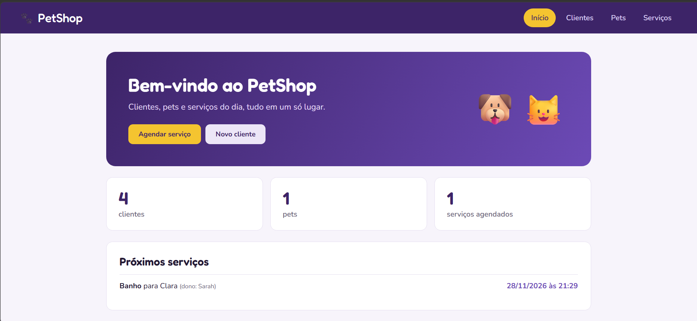
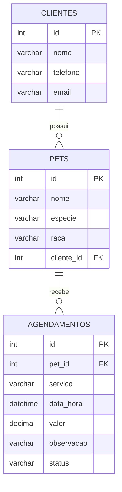

# 🐾 PetShop

Sistema web para gerenciar um petshop: cadastro de **clientes** e **pets**, e agendamento de **banho, tosa, consulta veterinária e vacinação**.


<!--
📸 Para adicionar prints do site:
1. Salve as imagens em docs/screenshots/ (ex.: inicio.png)
2. Apague este comentário e descomente a seção abaixo.

## 📸 Telas


-->

## ✨ Funcionalidades

- **Painel inicial** com totais (clientes, pets, agendamentos) e os próximos serviços marcados
- **Clientes**: cadastrar, editar, excluir e buscar por nome, e-mail ou telefone
- **Pets**: cadastrar, editar e excluir, sempre vinculados a um dono
- **Serviços**: agendar, marcar como concluído e excluir, com o valor definido automaticamente pelo tipo de serviço
- **Máscara de telefone**, confirmação antes de excluir e bloqueio de datas passadas no agendamento
- **Tela de erro amigável** quando o MySQL está desligado
- **Versão de terminal** (menu em texto) para cadastrar e listar clientes e pets

## 🛠️ Tecnologias

| Camada | Tecnologia |
|---|---|
| Back-end | Python, Flask |
| Banco de dados | MySQL (`mysql-connector-python`) |
| Front-end | HTML, CSS e JavaScript, com templates Jinja2 |
| Configuração | `python-dotenv` (variáveis de ambiente) |

## 🗂️ Estrutura do projeto

```
petshop-flask/
├── app.py               # Rotas do site (clientes, pets, serviços)
├── banco.py             # Conexão com o MySQL e funções de consulta
├── schema.sql           # Criação do banco e das tabelas
├── menu_terminal.py     # Versão em terminal (menu de texto)
├── requirements.txt     # Dependências do projeto
├── .env.example         # Modelo das variáveis de ambiente
├── templates/           # Páginas HTML (base.html é o molde das demais)
│   ├── base.html
│   ├── index.html
│   ├── clientes.html
│   ├── cliente_form.html
│   ├── pets.html
│   ├── pet_form.html
│   ├── servicos.html
│   ├── agendar.html
│   └── erro.html
├── static/
│   ├── style.css        # Visual do site
│   └── script.js        # Comportamentos na tela
└── docs/screenshots/    # Prints do projeto
```

## 🗃️ Modelo do banco de dados



Ao excluir um cliente, seus pets e agendamentos também são removidos (`ON DELETE CASCADE`).

## 🚀 Como rodar

### Pré-requisitos

- [Python 3.10+](https://www.python.org/downloads/)
- [MySQL](https://dev.mysql.com/downloads/) instalado e **em execução**

### Passo a passo

**1. Clone o repositório**

```bash
git clone https://github.com/SEU-USUARIO/petshop-flask.git
cd petshop-flask
```

**2. (Opcional, recomendado) Crie um ambiente virtual**

```bash
python -m venv .venv

# Windows
.venv\Scripts\activate

# Linux / macOS
source .venv/bin/activate
```

**3. Instale as dependências**

```bash
pip install -r requirements.txt
```

**4. Configure as variáveis de ambiente**

Copie o arquivo de exemplo e preencha com os dados do seu MySQL:

```bash
# Windows
copy .env.example .env

# Linux / macOS
cp .env.example .env
```

```env
DB_HOST=localhost
DB_USER=root
DB_PASSWORD=sua_senha_aqui
DB_NAME=petshop
SECRET_KEY=uma-frase-secreta-qualquer
```

**5. Inicie o site**

```bash
python app.py
```

**6. Acesse no navegador:** http://127.0.0.1:5000

> Na primeira execução, o próprio `app.py` cria o banco `petshop` e as tabelas lendo o `schema.sql`. Dados que já existirem não são apagados.

### Versão de terminal (opcional)

```bash
python menu_terminal.py
```

## 🌐 Rotas principais

| Rota | O que faz |
|---|---|
| `/` | Painel inicial com totais e próximos agendamentos |
| `/clientes` | Lista e busca de clientes |
| `/clientes/cadastrar` | Cadastro de cliente |
| `/clientes/<id>/editar` | Edição de cliente |
| `/pets` | Lista de pets |
| `/pets/cadastrar` | Cadastro de pet |
| `/servicos` | Lista de agendamentos |
| `/servicos/agendar` | Novo agendamento |

## 💰 Serviços e preços

Definidos no dicionário `SERVICOS` em `app.py`:

| Serviço | Valor |
|---|---|
| Banho | R$ 50,00 |
| Tosa | R$ 70,00 |
| Banho e tosa | R$ 110,00 |
| Consulta veterinária | R$ 150,00 |
| Vacinação | R$ 90,00 |

## 🔒 Segurança

- Credenciais do banco ficam no `.env`, que está no `.gitignore` e **não vai para o GitHub**
- Consultas SQL parametrizadas (`%s`), o que evita SQL Injection
- Projeto com finalidade de estudo: o servidor roda com `debug=True`, então não é indicado para produção como está

## 📌 Próximos passos

- [ ] Login para funcionários (Flask-Login)
- [ ] Histórico de serviços por pet
- [ ] Mover o catálogo de serviços e preços para uma tabela no banco
- [ ] Relatórios de faturamento por período

## 👩‍💻 Autora

**SEU NOME**

[](https://www.linkedin.com/in/SEU-PERFIL)
[](https://github.com/SEU-USUARIO)
